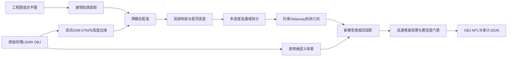
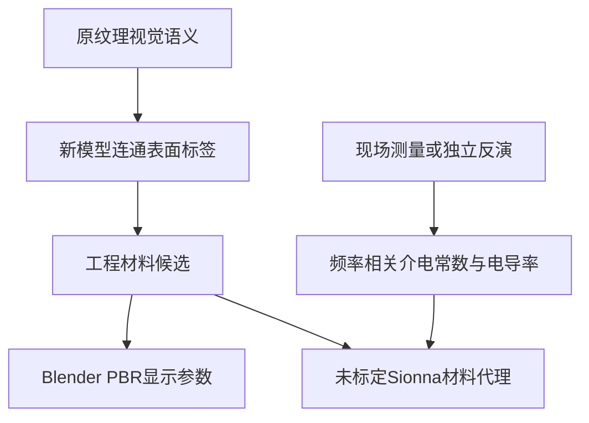

# 工程图约束 LiDAR 几何重构与原模型材质回投影

## 🧭 方法目标

本流水把“规则几何”和“表面材质解析”作为一个连续问题处理。工程图提供建筑平面边界，原始 LiDAR/摄影测量网格提供高度、屋顶层次、局部地面和纹理语义证据。系统不直接简化原网格，而是重新生成规则封闭实体，再把原模型证据投回新表面。



## 🧱 为什么不直接简化 LiDAR

直接降面会把扫描噪声、玻璃反射伪几何和局部法线抖动一起保留下来。同一块物理墙面仍可能被拆成大量方向略有不同的三角形，材质分类也容易在相邻三角形之间跳变。工程图轮廓提供平面边界约束，LiDAR 只承担其更可靠的任务：确定场景坐标、高度分布和原表面证据。

## 🏗️ 几何自动化

工程图中的建筑填色经过 RGB 范围、连通域、孔洞修复和拓扑保持简化，形成规则 footprint。系统把 footprint 边界与 LiDAR 代表高度图的梯度边缘进行两阶段 chamfer 搜索，联合求解旋转、比例和平移。每栋建筑在外环估计局部地面，在内部估计合理屋顶高度；当高度直方图出现多个稳定峰时，系统在 footprint 内生成多高度连通域。每个连通域最后通过约束 Delaunay 三角剖分和侧墙挤出形成封闭实体，非流形边数必须为零。

## 🎨 原 LiDAR 材质回投影

原始纹理网格先具有面级视觉语义，例如玻璃、混凝土外墙、屋顶和其他建筑表面。系统把这些面级证据聚合成三维语义体素索引。对新模型的每个屋顶、底面或共面立面边段，系统采样顶点、中点和质心，在邻域体素中寻找原网格证据，并按距离、原置信度和体素票数加权。

决策单位是新模型的连通表面，不是单个三角面。因此，同一块玻璃幕墙的两个导出三角形共享一个标签和同一组审计信息。输出同时记录原模型命中率、主标签票数占比、组合置信度、来源和失败原因。覆盖不足、类别纯度不足或组合置信度不足时，状态固定为 `REVIEW_REQUIRED`。



视觉标签不能直接证明现场施工材料，也不能给出介电常数、电导率或频率相关损耗。未经过测量的 Sionna 映射必须标为代理材料。

## ✅ 运行门禁

机器门至少检查工程图轮廓数、配准 IoU、具有直接 LiDAR 高度的建筑比例、封闭几何的非流形边数和材质回投影命中率。所有门通过只表示自动流水在当前数据上运行完整；由于没有独立 GCP、竣工 BIM、人工材质真值和现场电磁测量，科学状态仍为 `REVIEW_REQUIRED`。

## 🧪 完整校园远端试运行

服务器端实际运行使用完整总平图、原始校园 OBJ 和既有原网格语义体素索引，未读取人工面片标注。最终机器报告为 `operational_status=PASS`、`scientific_status=REVIEW_REQUIRED`，五项门禁（轮廓、配准、高度、几何、材质）全部通过。

| 指标 | 结果 |
|---|---:|
| 工程图建筑轮廓 | 35 |
| 轮廓总面积 | 115,721.678 m² |
| 配准显著屋顶轮廓 IoU | 0.6685 |
| 直接 LiDAR 高度建筑 | 32 / 35 |
| 自动 fallback 建筑 | 3 |
| 建筑高度部件 | 160 |
| 输出顶点 / 三角形 | 25,490 / 10,304 |
| 连通表面 | 3,031 |
| 部件内非流形边 | 0 |
| 自动接受的视觉先验表面 | 1,377 |
| 待复核表面 | 1,654 |
| 平均原模型语义命中率 | 0.5984 |
| 整链耗时 | 54.005 s |

运行中曾发现三类真实故障并修复：缺失局部地面时高度数组形状不一致；工程图轮廓修复顺序导致 35 栋只提取到 31–33 栋；普通三角剖分跨越孔洞造成几何边界问题。最终分别通过全尺寸缺失值栅格、保持孔洞的拓扑修复顺序和约束 Delaunay 三角剖分解决。另有 1 条跨独立封闭部件的重合坐标边，已单独报告，不伪装成部件内部非流形错误。

## 🚀 命令入口

```bash
python tools/run_stage.py \
  --config config/hkustgz_auto_reconstruction.example.yaml \
  --stage all
```

输入大 OBJ 只做流式扫描，原始资产保持只读。配置、源文件大小与时间戳、语义索引以及重构模块源码共同形成运行指纹；代码发生改变时会生成新的运行目录，不会静默复用旧结果。
