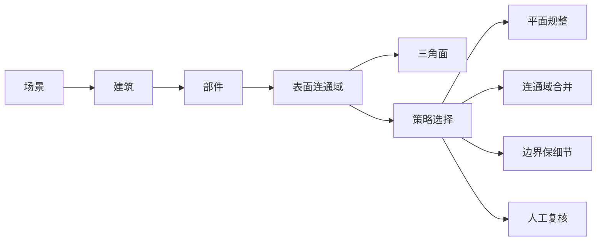
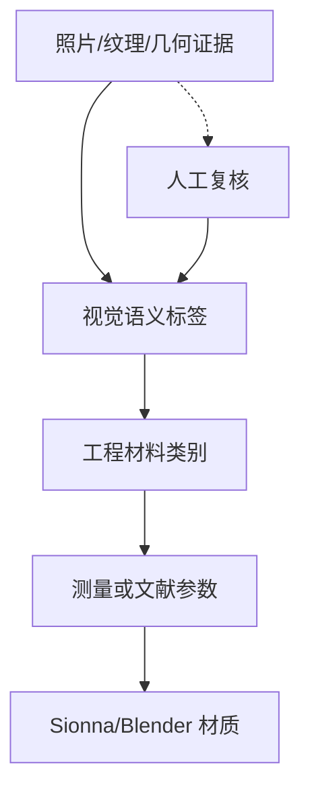
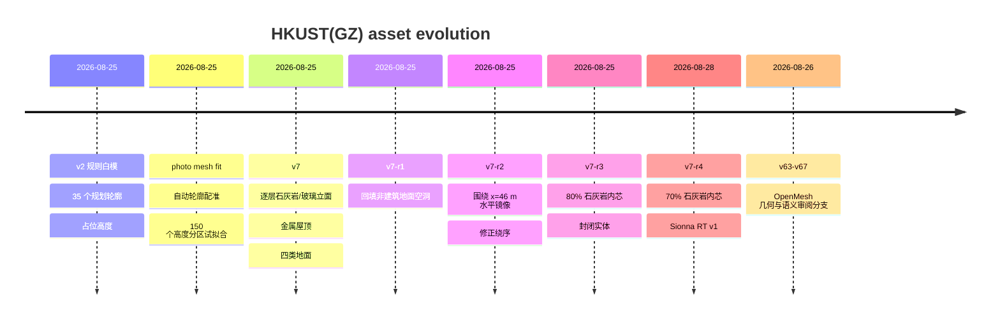

# HKUST(GZ) LiDAR 到可仿真的清洁地图完整工作报告

_面向 HKUST(GZ) 单场景几何重构、建筑表面语义映射、地面材质整理与 Sionna RT 转换的阶段性总报告；依据可见会话历史、本地项目文件、Git 提交记录和已保存服务器部署快照整理。_

---

## 📋 摘要与结论

本项目要解决的不是“给一个三维模型换颜色”，而是把摄影测量/LiDAR 得到的高密度、碎片化、带光照纹理的模型，整理成**几何更规整、建筑层级可解释、材质语义可审阅、可导入 Blender 和 Sionna RT 的单场景资产**。最终形成的路线是：用 LiDAR/摄影测量保留位置、高度和局部屋顶证据，用工程图或规划轮廓约束建筑平面，用地面人工标注约束道路/水体/植被/石材，再在建筑、部件和表面连通域层面融合语义，最后独立赋予电磁材料先验。

当前最完整的几何产物是 V7-r4 70% 石灰岩内芯模型：35 栋建筑、153 个高度部件、2,821 个封闭实体记录、351,974 个三角面、8 个材质组，已通过拓扑和 Sionna 场景烟测。它是**可用于仿真流程验证的实验资产**，不是竣工 BIM、测绘级模型或现场电磁标定结果。

当前最重要的科学结论是：视觉语义只能回答“这个面更像哪一类表面”，不能直接给出频率相关的介电常数、电导率或粗糙度；Sionna 中的 `marble`、`concrete`、`wet_ground` 等是代理先验。三方法先导实验也只在低精度校园代理和有限 NR7 条件下比较传播预测，不能外推为跨场景或真实材料识别结论。

## 🗺️ 项目背景与最初问题

原始数据链同时包含 LiDAR/摄影测量网格、OBJ/PLY/B3DM/OSGB、纹理或多视角照片、规划图建筑轮廓、地面人工标注和无线电仿真输入。它们的用途不同：网格提供几何，规划图提供平面结构先验，照片提供视觉语义，实测无线电数据才可能约束传播参数。

初始模型暴露出几个相互关联的问题：

1. 大面积平整墙面被切成成百上千个细碎三角面，导致法线不连续、局部微小起伏和边界锯齿。
2. 直接 decimation 只优化面数或局部几何误差，不知道哪些三角面属于同一片玻璃、同一面墙或同一屋顶，因此可能降低面数却保留错误法线和错误边界。
3. 纹理烘焙了阴影、阳光、反射和遮挡。可见颜色不能直接当作毫米波/厘米波材料参数。
4. 玻璃的反射/透射会让摄影测量产生假几何，或者把环境倒影错误贴到墙面。
5. 按单个三角面独立分类，会把一整片连续玻璃分成许多材质，造成材料标签跳变。
6. 地面栅格转矢量、建筑避让和小面片过滤会留下空洞；若没有建筑排除掩膜，道路和地面材质会穿入建筑。
7. 规划图、LiDAR 和纹理画布一度出现水平镜像和坐标错位，必须把变换记录为可审计合同。


_图 1：实际 OpenMesh 低面数审阅图；它说明“面数变少”并不等于平面、法线和边界已经正确。_

## 🔍 数据来源与证据等级

| 证据/资产 | 主要用途 | 当前证据等级 | 不能直接推出 |
|---|---|---|---|
| LiDAR/摄影测量 OBJ、PLY、B3DM、OSGB | 几何位置、高度、纹理回投 | 实际输入/实验产物 | 竣工尺寸、实测材料参数 |
| 规划图建筑轮廓 | 平面形状、建筑对象约束 | 实际图纸提取的结构先验 | 完整建筑施工细节 |
| 多视角纹理/照片 | 视觉类别候选 | 语义先验 | 电磁真值 |
| 人工地面图 | 沥青、水体、植被、石材区域 | 用户定义标注 | 材料型号、介电常数 |
| 摄影网格高度图/DSM | 相对屋顶高度和层次 | 自动试拟合，待复核 | 测绘级高程、楼层实数 |
| NR7 RSRP 与 RT 代理 | 传播预测比较 | 有限先导实验 | 真实材料唯一反演 |
| Sionna ITU 类别 | 运行烟测和初始仿真 | 未标定工程先验 | 现场频率相关参数 |

原始输入应只读保留。任何自动旋转、镜像、缩放、平移、重采样和标签传播都应在清单中记录，避免把中间产物误当作原始数据。

## 🧱 初始 LiDAR/摄影测量模型

早期工作先对校园资料、模型格式和坐标元数据进行盘点。远程 `Campus基模` 中可见一套校园模型，按 BlockB/BlockY 分块并提供 B3DM、OBJ、OSGB 和 PLY。B3DM 适合网页查看，OBJ 适合 Blender/引擎，PLY 适合 MeshLab、CloudCompare 和 Open3D，OSGB 保留原摄影测量瓦片结构但依赖专用工具链。纹理 JPG 只作为可见光参考，不应直接视为 RF 材料。

随后从 2022 总平图提取 35 个建筑轮廓，构成 `完整校园-v2-geometry` 的规则白模。该版本的目标是平滑的 LOD1 级体块，而不是还原每个窗框；早期高度使用 10/16/20/24 m 的占位值，状态记为 `XY_PLAN_FIT_Z_PHOTO_MESH_FIT_PENDING`。这一步解决了“平面轮廓锯齿”和“每个建筑对象没有稳定 ID”的问题，但没有解决真实高度。

> **证据边界：** 早期白模高度是占位或结构先验，不能写成测绘高程，也不能据此声称已获得完整施工图或竣工 BIM。

## 📐 规则白模重构

规则白模的核心思想是让规划图约束建筑的 XY 形状，让 LiDAR/摄影网格提供 Z 向高度和局部屋顶证据。两者职责分离后，模型不再需要把摄影测量的每一个噪声三角面都原样继承。

处理逻辑是：先按轮廓生成平滑闭合多边形，再按建筑对象 ID 生成体块；随后用高度图统计局部地面、屋顶峰值和相对高度；存在多个屋面高度峰时拆成塔楼、裙房、连廊或平台等独立高度区。建筑边缘和小部件不应被无条件抹平，因为它们会影响遮挡、绕射和射线传播。


_图 2：实际建筑排除掩膜；建筑对象先从地面层中分离，再处理道路和地面材质。_

## 📏 高度配准与多高度拆分

`photo_mesh_fit_attempt` 是一次可复现的自动试拟合，不是正式高度交付。规则轮廓与摄影测量正射高度图的自动配准结果为：旋转约 `-0.5°`、尺度约 `1.005`、列方向平移约 `-46 m`、行方向平移约 `-24 m`。显著屋顶掩膜 IoU 为 `0.6687`，仅中心重合 IoU 为 `0.2688`，自动拟合提升约 `0.3999`。

35 个候选建筑中 32 个获得可用高度样本；32 栋高度中位数约 `27.413 m`。其中 23 个建筑存在多个屋面高度峰或较大高度离散度，因此进一步拆成 150 个独立高度分区。多层分区版共 10,800 个三角面，footprint 覆盖率中位数约 `99.71%`，最低约 `97.83%`；并集版采用 1 m XY 单元最高屋面采样，包含 41 个高度层、1,237,816 个三角面，非流形边为 0。

这一步的贡献是把“整栋楼统一拉伸”改为“按局部高度组织建筑”。但自动配准没有独立 GCP，树冠、设备和复杂屋顶仍可能污染高度样本，所以状态保留为 `REVIEW_REQUIRED_AUTOMATIC_SILHOUETTE_FIT`。

## 🌳 地面标注与道路整理

地面采用用户人工颜色合同：黑色为沥青，蓝色为水体，绿色为植被，未标记的非建筑区域回填为石材；建筑区域由掩膜硬排除。地面和建筑分层保存，避免地面多边形覆盖立面或穿入建筑内部。

原 V7 诊断发现约 `14,697.892 m²` 非建筑区域没有地面面片。原因包括栅格转矢量逐类简化、建筑外扩避让和小于 `1 m²` 面片过滤。V7-r1 在完整画布中扣除建筑、沥青、水体和植被后，把剩余非建筑差集回填为石材，消除了空洞，但仍保留“视觉标签而非材料真值”的边界。

道路处理采用连通域合并、建筑外扩缓冲区和曲线平滑；水体边界不参与道路平滑。启发式 A* 补路曾产生 34 条待人工复核桥接，说明自动寻路可补拓扑但不能替代人工道路边界判断。1 m 级地面适合快速粗模，0.2 m 级适合局部细化；分辨率越高，文件和浏览器内存成本越大，并不自动提高标注正确性。


_图 3：实际地面审阅图；建筑白色排除，黑色沥青、蓝色水体、绿色植被和剩余石材分开管理。_

## 🧠 纹理识别与语义分割

早期视觉分支尝试使用 SegFormer-ADE20K 和 UV 回投：每个三角面采样多个 UV/重心位置，再结合纹理概率和几何特征生成语义。V4 曾使用近水平法向先验把大量面强制归入屋顶，结果屋顶约 `1,702,075` 面，出现大片系统性误判。问题在于“近水平”只说明方向，不等于“屋顶”；平台、地面、低矮构件和水平设备也会满足同一条件。

V5 保留原始照片纹理，把语义结果作为半透明覆盖层，解决了整块纯色覆盖导致“模型看不清”的审阅问题。V7 取消近水平面强制屋顶规则，保留概率、类别 margin 和七点采样一致性；低置信度区域进入未知。V7 面级计数为：未知 `222,761`、水体 `1,386`、草地 `1,804`、土壤 `2,828`、植被 `218,139`、混凝土外墙 `2,466,622`、玻璃立面 `90`、其他建筑表面 `169,431`，合计 `3,083,061` 面。V7 屋顶为 0 并不表示场景没有屋面，而是照片分类器没有足够证据可靠分出屋顶。


_图 4：同一组件的实际 UV/纹理样本；阴影、反射、重复投影和遮挡说明不能逐三角面独立决定材质。_

V54 自动审阅处理约 `3,083,061` 个面和 `416,259` 个表面组件，保留约 `7,080` 个保守接受候选，并区分 `AUTO_ACCEPTED`、`REVIEW_REQUIRED`、`UNKNOWN` 和 `MANUAL_LOCKED`。在 45 个组件的 CLIP/SAM 平衡样本中，CLIP 支持源标签 16 个、反驳 26 个、无法判断 3 个；15 个支持样本中只有 1 个通过边界门，13 个失败，1 个不可见。因此保留 `NO_GO_NEW_PROMOTIONS`：视觉模型可以生成候选，但不能自动提升为最终材料。

## 🔗 连通域级材质映射方法

材质映射最终采用“区域先于面片”的层级策略，而不是让每个三角面各自投票：



大面积近共面墙面和玻璃幕墙优先合并连通域并执行平面拟合；建筑角边缘、窗框和突出构件保留细节；反光、阴影、遮挡或多源冲突区域降低视觉证据权重并进入人工复核。人工修订作为高优先级证据回写，但不覆盖原始标签。

这一层级设计直接对应用户提出的“玻璃是连片的，却被切成很多三角面”的问题：先确认一个物理表面组件，再把同一材质标签传播到内部三角面，能够降低标签熵和不必要的材质跳变。材质类别、工程类别和电磁参数仍需分成三层：



## 🧪 版本演进与问题修复



| 版本 | 核心目标 | 主要问题/限制 | 当前作用 |
|---|---|---|---|
| v2 | 规划轮廓粗模 | 高度占位，未融合照片高度 | 平面结构起点 |
| photo fit | 轮廓与 DSM 配准 | 无 GCP，自动试拟合 | 高度分析和人工复核 |
| V4 | 全密度视觉语义 | 近水平规则造成屋顶泛化 | 历史对照 |
| V5 | 纹理底图+透明语义层 | 仍有低矮屋面/反射误判 | 人工审阅 |
| V6 | 近地浅绿候选 | 启发式，不是颜色真值 | 近地复核 |
| V7 | 概率+七点一致性 | 屋顶证据不足，仍需人工 | 面级语义先验 |
| V54 | 组件级自动审阅 | CLIP/SAM 门禁失败 | 保守候选筛选 |
| v63 | 1/80 OpenMesh | 低模仍非 RF 几何 | 快速几何审阅 |
| v64 | 立面区域代理 | N-gon 渲染仍会三角化 | 立面候选比较 |
| v65 | 六类语义区域 | 玻璃/水体多为人工审阅 | 语义覆盖层 |
| v66 | 19,610 面低模语义 | 小窗/窄带可能被多数投票吞并 | 低面数查看 |
| v67 | 高度/水平性规则 | 规则结果只到 LIGHT_FAIL/REVIEW_ONLY | 可解释候选 |
| V7-r4 | 封闭分层实体 | 70% 内芯是用户建模先验 | Blender/Sionna 实验资产 |

关键修复包括：V7-r1 地面补洞；V7-r2 使用正确镜像 `x' = 92 - x` 并反转三角绕序；V7-r3/r4 将表面颜色壳升级为逐层封闭实体；v65-v67 修正语义层与 v64 底座重复旋转的问题。

## 🏢 当前 V7-r4 模型

V7-r4 从正确镜像的 V7 地面和建筑分支生成，逐高度部件建立封闭表面：每层下半段是完整石灰岩体；上半段是 30% 玻璃环和 70% 中央石灰岩内芯；屋顶使用金属；底面使用隐藏建筑底材质。这里的“实体”是边界表示中的 watertight closed surface，不是体素或四面体实体。

| 项目 | 当前值 |
|---|---:|
| 建筑数 | 35 |
| 高度部件 | 153 |
| 封闭实体记录 | 2,821 |
| 总三角面 | 351,974 |
| 模型边界 X/Y/Z | `[-504,596] / [-634,586] / [0,53] m` |
| 非流形或非正体积实体 | 0 |
| GLB SHA-256 | `62711fdb8ef790fe36eb2f94687beeb594906c3a76c4393fefe5f6eb1c52d4c8` |

GLB 的 Blender PBR 视觉参数包括金属屋顶 `metallic=0.88, roughness=0.35`，石灰岩 `roughness=0.82`，玻璃透明度约 `0.55`。这些是可视化/工程先验；70% 内芯不是施工结构证据，玻璃和石灰岩也不是已测频率相关 EM 参数。

## 🚀 Sionna RT 转换与服务器部署

V7-r4 已转换为 Sionna RT v2.0.1 使用的 8 个 binary little-endian PLY，并生成 `scene.xml`、`conversion_audit.json`、`material_manifest.json` 和 `server_validation.json`。转换未改变坐标，保持本地 ENU-compatible、Z-up 坐标；场景包含 1,055,922 个顶点和 351,974 个三角面。

| 视觉/工程标签 | Sionna 先验 | 解释 |
|---|---|---|
| metal roof | `metal` | 内置 ITU 类别 |
| limestone | `marble` | 石材族代理 |
| glass | `glass` | 内置玻璃先验 |
| building base | `concrete` | 隐藏结构底代理 |
| asphalt | `concrete` | 无 asphalt 内置类 |
| water | `wet_ground` | 无 water 内置类 |
| vegetation | `medium_dry_ground` | 无植被体积模型 |
| stone paving | `marble` | 石材铺装代理 |

服务器烟测使用 Sionna RT `2.0.1`、Mitsuba `3.8.0`、`cuda_ad_mono_polarized`，频率 `3.5 GHz`，单 Tx/Rx，`4096 samples/source`，最大路径深度 1；输出有限幅度和时延，状态为 PASS。这里的 PASS 只表示场景可加载、路径求解可运行，不表示材料已标定。

## 📊 三方法先导实验与材料参数边界

用户此前将三类方法命名为：U2 无标定材质、S4W WEDT-inspired、S5 OneTwin-style。现有先导实验使用低精度 `RT_HKUSTGZ` 代理模型和校内 NR7 RSRP，拟合日期为 0804/0805，0817 为日期留出评分；不使用 Munich/E8 数值，也不使用完整 BlockB/BlockY 高密度网格。

主评分中，S4W 在 6 个条件中 4 次最低 MAE，S5 2 次，U2 0 次。这个结果只能说明在当前代理几何、暂定站点和数据划分下，S4W 的传播预测较常胜；不能说明它在原论文完整任务、其他城市或真实部署中普遍最好。

材料解释必须更谨慎：U2 输出空间残差，不输出材料后验；S4W 的有效介电参数在频段和假设高度间切换；S5 的离散 ITU 标签也随条件变化，且与 RT XML 初始组名的一致性很弱。因此真实材料反演门禁为 `NO_GO`。没有现场 sounding、完整 Tx 配置和已知材料控制区时，不能把后验唯一归因给玻璃、砖、混凝土或地面。

此前 E8 corrected-v3 曾设计 bounded pilot、readiness audit 和 K=10 成对 hidden realizations；之后用户明确放弃 K=10，因此不得把 E8 formal 结果、K=10 配对置信区间或跨场景结论写入当前成果。现阶段只保留已完成的单场景 pilot/代理结果。

## 🧯 失败问题、原因与修复

| 问题 | 原因 | 修复 | 验证/剩余风险 |
|---|---|---|---|
| LiDAR 面片碎、墙面锯齿 | 摄影测量/MVS 的局部三角化和噪声 | 规划轮廓约束 + 平面/连通域重构 | 几何更规整；无测绘级 GCP |
| 直接降面仍不平 | decimation 不理解物理表面 | 语义层级选择平面规整或保细节 | OpenMesh 仅审阅，不替代 RF 几何 |
| 整块蓝绿灰看不清 | 纯色覆盖遮住原纹理 | 原始纹理底图 + 半透明语义层 | 浏览器审阅可用 |
| 玻璃被拆成很多材料 | 逐三角面独立分类 | 表面连通域级合并，再传播到面 | 需人工复核反光边界 |
| 屋顶大面积误判 | 近水平法向被强制当屋顶 | V7 取消强制规则；高度规则降级为候选 | 屋顶/平台仍需人工 |
| 地面出现空洞 | 栅格简化、建筑外扩、小面片过滤 | 非建筑差集回填石材 | 补洞是启发式，不是地质调查 |
| 道路穿过建筑 | 没有建筑排除掩膜 | 建筑缓冲区作为不可穿越区域 | A* 桥接仍待人工 |
| 整个模型水平反了 | 使用了错误的 `x -> -x` | 围绕 `x=46 m` 用 `x'=92-x`，同步反转绕序 | 与旧分支哈希可审计；无独立 GCP |
| v64 底座与语义层分离 | 顶点已 Y-up 却重复应用节点旋转 | 中和冗余 `+90° X` | v65/v66 门禁通过 |
| VLM/SAM/CLIP 误判 | 反射、遮挡、低分辨率和域差异 | 只作候选先验，保留 REVIEW_REQUIRED | V54 仍 NO-GO 新晋升 |
| Sionna 无 asphalt/water/vegetation 类 | 内置 ITU 类别不覆盖所有地面 | 使用明确标注的代理类别 | 必须后续测量/校准 |

## 🧰 GitHub 开源工程

仓库地址：[LiDAR-Radio-Synthesis](https://github.com/dentar142/LiDAR-Radio-Synthesis)。`0e7f4c5 Define adaptive semantic reconstruction hierarchy` 是全自动实现前的最后一个方法骨架版本；后续版本在此基础上实现工程图约束 LiDAR 重构、原模型语义回投影、机器门禁和审计导出。

仓库目录为 `config/`、`docs/`、`figures/`、`src/`、`tests/` 和 `tools/`。除通用 geometry、building、semantic、materials、ground、georef、export 阶段外，`src/reconstruction/` 已实现流式 OBJ 正射栅格化、工程图轮廓提取、跨模态配准、LiDAR 高度拟合、多高度部件拆分、约束 Delaunay 封闭实体生成、原网格语义体素回投影和连通表面材质聚合。`tools/run_stage.py` 根据配置模式执行通用审计或完整重构事务。

必须准确说明：当前仓库已经是**可运行的全自动研究基线**，但不是测绘级、竣工级或无需审阅的生产工具。它能够在没有人工面片标注的情况下生成规则几何和表面材质候选；它没有把完整 VLM 推理、现场材料真值、电磁参数反演或 Sionna 全量生产部署伪装成已完成能力。低覆盖和证据冲突表面必须保留为 `REVIEW_REQUIRED`。

完整校园远端试跑从总平图恢复 35 栋建筑，32 栋取得直接 LiDAR 高度，形成 160 个封闭部件、10,304 个三角形和 3,031 个连通表面。部件内非流形边为 0；材质回投影平均语义命中率为 0.5984，1,377 个表面达到自动候选阈值，1,654 个表面待复核；五项运行门禁全部 PASS，整链约 54 秒。由于缺少独立 GCP、人工材质真值和现场电磁测量，科学状态仍为 `REVIEW_REQUIRED`。

许可证当前为 GPL-3.0，适用于仓库代码；校园模型、官方图纸、原始纹理和服务器资产的版权与使用权限不因代码许可证自动改变。

## 🧭 当前成果、风险和未完成事项

### 已实现或已验证

- 35 栋规划轮廓白模和照片高度试拟合产物已保存。
- 工程图 + 原 LiDAR 的全自动重构和原模型材质回投影已在远端完整数据上运行，五项运行门禁通过。
- V7 地面人工标签、建筑排除、空洞回填和水平镜像分支已保存。
- V7-r4 70% 石灰岩内芯封闭实体通过 watertight、面数、边界和材质组审计。
- Sionna RT 场景转换、8 个 PLY 对象和单 Tx/Rx 烟测通过。
- V4/V5/V6/V7/V54、v63-v67 语义/几何审阅分支均有部署快照或本地归档。
- 三方法单场景代理 pilot 有 24 个完成作业、日期留出评分和明确的材料反演 NO-GO。

### 实验性、待人工审阅

- 自动高度拟合、150 个高度分区和 3 个 fallback 建筑仍为 `REVIEW_REQUIRED`。
- 70% 石灰岩内芯、逐层玻璃环、金属屋顶属于建模先验，不是施工结构证据。
- V7/V54 和 OpenMesh 语义标签是视觉/几何候选，不是人工真值，不应报告 accuracy/IoU。
- Sionna 材质映射是未标定先验；真实参数需 sounding、文献范围或独立反演。
- 建筑楼名、施工材料型号、玻璃类型、沥青型号和地面石材型号尚未由完整施工/竣工资料闭环确认。

### 当前不能声称

- 未获得完整施工图、竣工 BIM 或测绘级绝对坐标验证。
- 未完成真实建筑材料识别、介电常数/电导率反演或频率相关材质校准。
- 未完成 VLM 全自动可靠分类；V54 的新候选晋升仍是 NO-GO。
- 未完成跨场景方法优越性结论；当前三方法结果仅限单场景代理 pilot。
- 未完成 E8 K=10 formal；该计划已由用户放弃，不能混入当前报告。

## 🔁 可复现入口与归档

本地/服务器统一入口：

```text
cd projects/HKUSTGZ-material-mapping
python -m pip install -e ".[runtime]"
python tools/run_stage.py --config config/hkustgz_auto_reconstruction.example.yaml --stage all
```

把示例配置中的只读源数据绝对路径替换为实际服务器路径后，该命令会执行完整的工程图约束重构和原模型材质回投影。V7-r4 的原始模型、审计、图片和 Sionna 转换文件位于：

```text
1-LEARN-学习库/2026-08-25·香港科技大学广州一期工程建筑资料汇编/
三维粗模试作/完整校园-v2-geometry/v7-r4-solid-floor-70pct-core/
```

服务器 Sionna 主实验目录由部署配置指定，V7-r4 作为独立资产放在 `assets/hkustgz-v7-r4-70pct-core-sionna-rt-v1/sionna-rt-v1/`，没有覆盖旧 `assets/scene_facets`。远程站点的完整路径、哈希和端口应以部署快照为准，报告不记录密码、令牌、data seed 或 Oracle 私有资产。

建议复现顺序为：

```text
geometry -> building -> semantic -> materials -> ground -> georef -> export
```

每一步都应保留输入摘要、版本、坐标变换、来源证据、失败门禁和输出哈希；任何门禁失败时停止下游自动合并。

## 📚 参考资料与内部证据

本报告的外部工程参考包括 SegFormer、SAM/CLIP、Sionna RT 和 Mermaid 文档；方法选择应以各项目官方文档和论文原文为准[^1][^2][^3][^4]。项目内部证据主要来自仓库 [`docs/methodology.md`](methodology.md)、[`docs/figure-guide.md`](figure-guide.md)、摄影高度试拟合 README、V7/V54/OpenMesh 部署快照、V7-r4 `solid_floor_70pct_core_audit.json`、Sionna `server_validation.json` 和三方法 pilot 的 `01-完整实验报告.md`、`findings.md`、`research-state.yaml`。

> **范围说明：** 本报告基于当前可见会话历史、本地 Obsidian/项目文件、Git 历史和已保存服务器记录；未导出的聊天、已删除文件或未保存的临时运行不可能被完整恢复。凡未在这些证据中出现的内容，均不应在组会上表述为已完成事实。

[^1]: NVIDIA. Sionna documentation. https://nvlabs.github.io/sionna/
[^2]: Xie, E. et al. SegFormer: Simple and Efficient Design for Semantic Segmentation with Transformers. https://arxiv.org/abs/2105.15203
[^3]: Kirillov, A. et al. Segment Anything. https://arxiv.org/abs/2304.02643
[^4]: Mermaid. Diagramming and charting tool documentation. https://mermaid.js.org/
