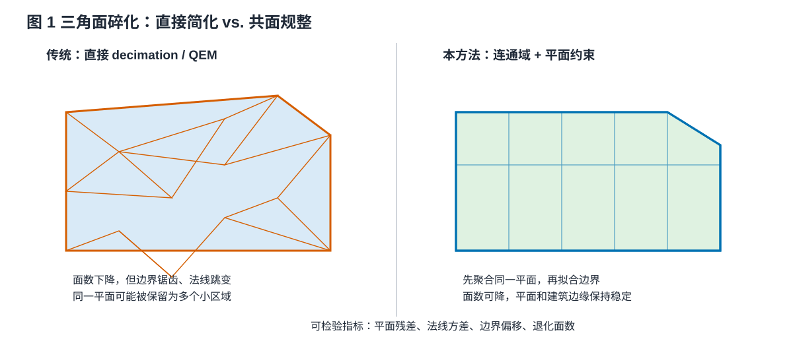
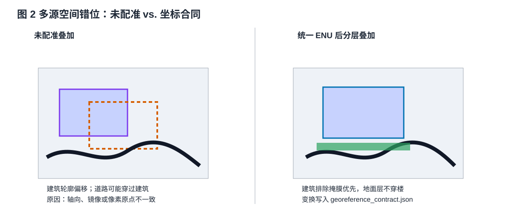
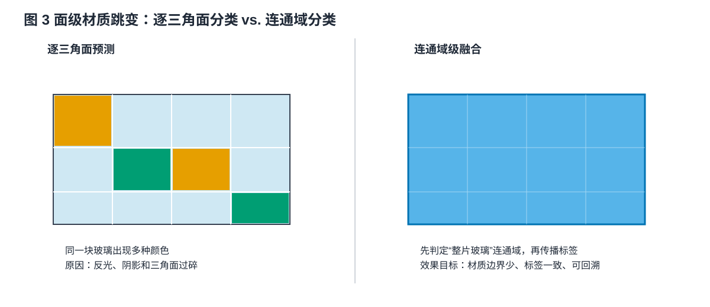
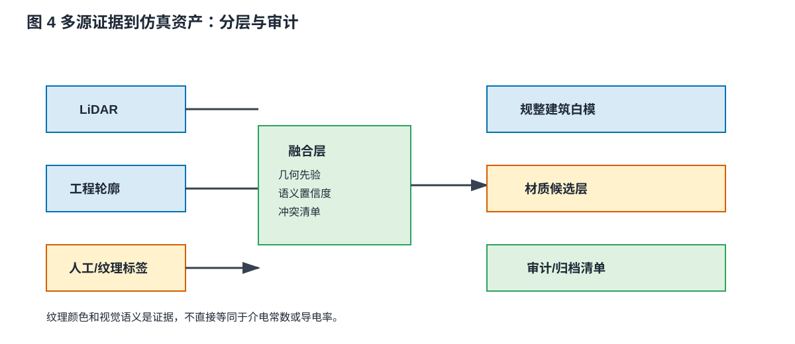
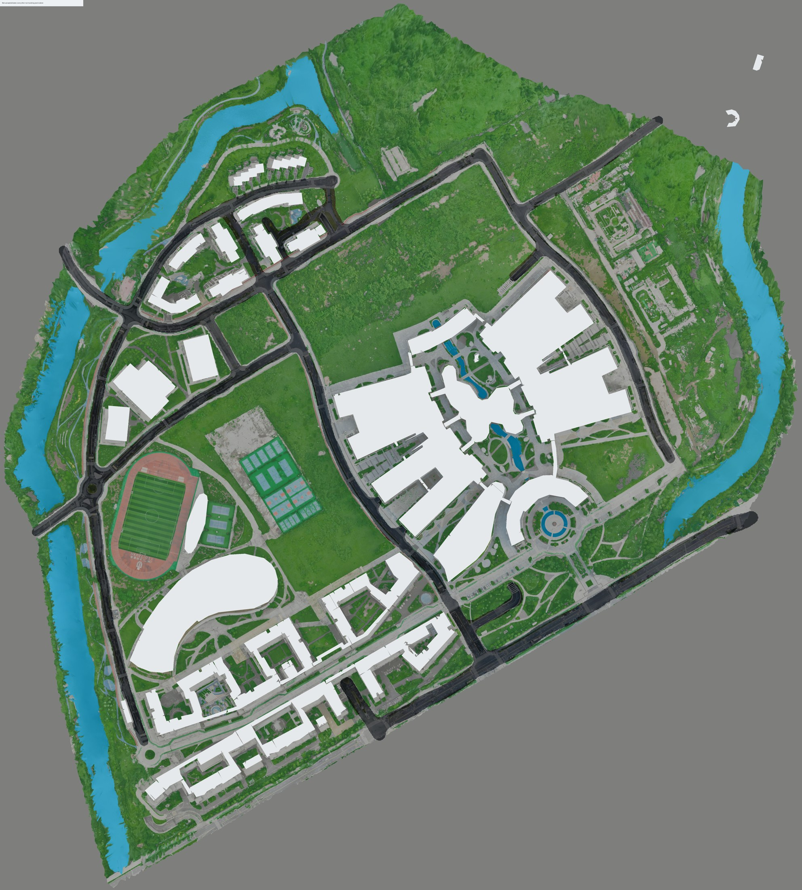
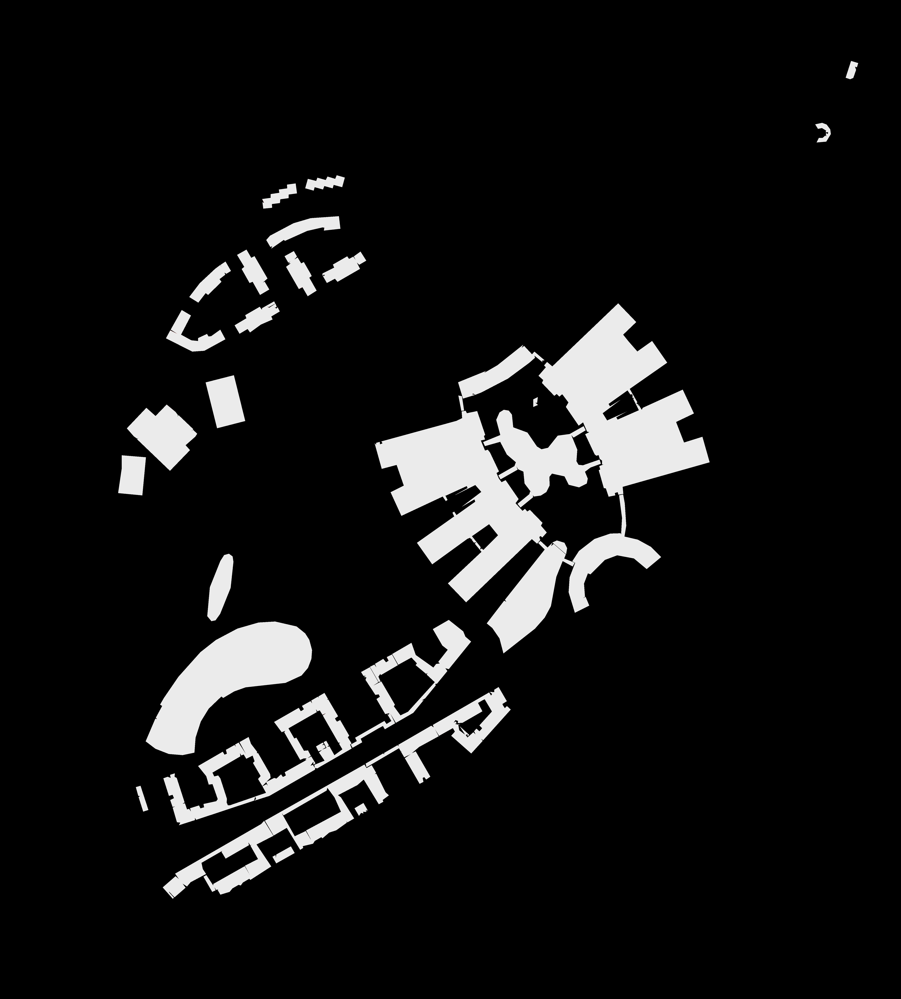
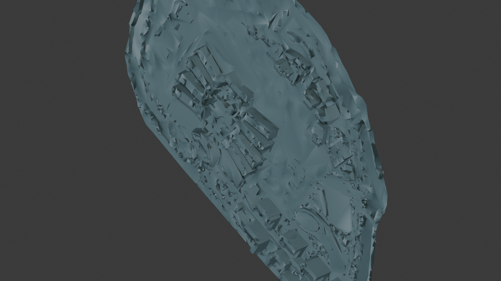
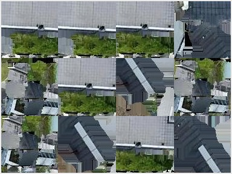

# 方法问题示例图与说明

这些图用于回答“传统方法为什么不够、问题在哪里、如何解决、效果如何”。它们是方法动机示意，不是 V6-r2 的真实定量结果。

**图 1 说明。** 直接 decimation 只优化面数或局部几何误差，无法理解一大片墙面属于同一个物理平面，因此可能留下锯齿边界和法线跳变。本方法先提取共面连通域，再施加平面和边界约束。效果通过平面残差、法线方差、边界偏移和退化面数验证。

**图 2 说明。** 建筑轮廓、LiDAR 和地面标注若存在轴向、镜像或像素原点差异，叠加后会造成建筑错位和道路穿楼。本方法把变换写入坐标合同，并让建筑排除掩膜优先于地面材质。

**图 3 说明。** 逐三角面分类会把反光、阴影和采样噪声放大为材质跳变。对玻璃幕墙、连续墙面等区域，应先在连通域或建筑部件层确定主标签，再传播到内部三角面。

**图 4 说明。** LiDAR 负责形态和高度，工程轮廓负责平面结构，人工/纹理标签提供材质证据；融合层输出带来源和置信度的结果，最终形成白模、材质候选和审计清单。视觉纹理不能直接作为电磁参数真值。

## 如何替换为真实结果

真实运行后，在每个图旁增加同一输入、同一坐标合同下的实测图，并报告：三角面数变化、平面拟合残差、建筑/地面 IoU、材质连通域数、人工复核准确率和导出哈希。没有这些数据时，只能使用“预期效果”或“可检验属性”，不能写成已验证提升。

## 真实截图样例

**真实样例 A：** V6-r2 的实际地面材质审阅图，可观察黑色沥青、蓝色水体、绿色植被、剩余石头地面和白色建筑排除区域。该图用于说明地面分层和建筑排除，不用于证明 LiDAR 几何规整效果。

**真实样例 B：** V6-r2 的建筑几何排除掩膜。白色区域表示建筑覆盖范围，可用于检查地面标签是否进入建筑内部，以及整体建筑布局是否发生镜像或错位。

**真实样例 C：** `openmesh-1over80-v63` 的 planar-5deg 审阅结果。局部表面仍可看到碎片化、凹凸和细小部件混杂，说明只进行几何简化并不能自动恢复建筑大平面。该图不是本仓库新算法的控制变量对照实验。

**真实样例 D：** V54 组件纹理蒙太奇，展示多视角纹理中的重复投影、光照差异和局部遮挡，这也是材质判别需要人工锁定、连通域平滑和来源审计的原因。
